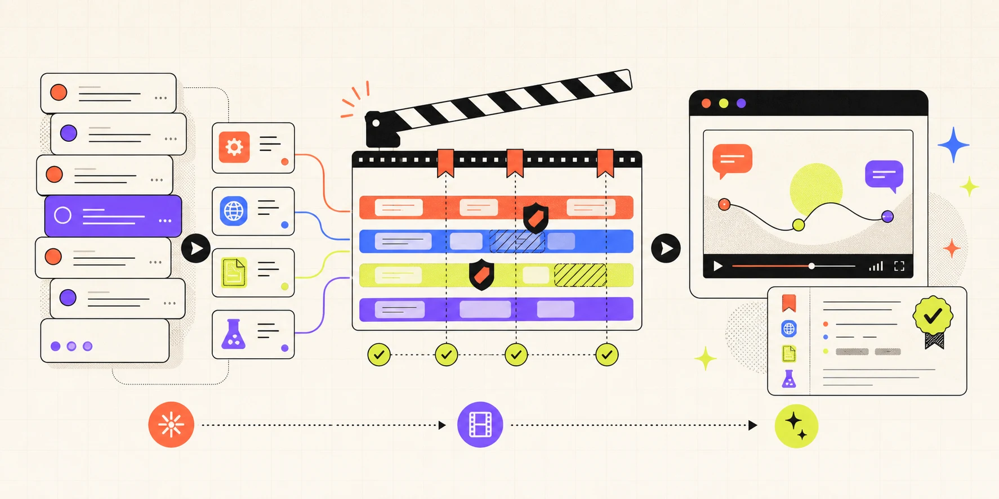

# Showrun



> **Show your agent's work.**
>
> Turn real agent sessions into replayable, inspectable documentation.

[Open Showrun](https://showrun-production.up.railway.app) ·
[Product strategy](./docs/product-strategy.md) ·
[Roadmap](./docs/roadmap.md)

Agent runs contain the most useful parts of a demo: the prompt, the decisions,
the tool calls, the sources, the failures, and the fix. They are also difficult
to explain, unsafe to publish raw, and easy to lose.

Showrun turns that execution trail into a watchable story. It imports a real
agent session, removes host-only scaffolding and likely secrets locally,
creates a smart-paced first cut, and publishes an immutable watch page that can
be shared or embedded like a video.

The project, Python package, and primary CLI are named `showrun`. The short CLI
alias is `sr`. Portable releases use the versioned `dvd/1` artifact format.

## See the value in one run

| Before Showrun | With Showrun |
| --- | --- |
| A useful agent run disappears into chat history | The run becomes durable, replayable documentation |
| Tool calls and sources are buried in a transcript | Observable execution expands into inspectable evidence |
| A screen recording shows pixels but not structure | Chapters, events, sources, and outcomes remain addressable |
| Publishing a raw transcript risks leaking local context | The session crosses a local sanitization boundary first |
| A demo lives in one tab or one meeting | The same release works as a watch page, embed, or portable artifact |

## How it works

```text
agent session
     │
     ▼
capture ──▶ sanitize ──▶ direct ──▶ publish ──▶ watch / embed / learn
             local        chapters     immutable
             boundary     + pacing     release
```

1. **Capture a real run.** Import a Codex rollout, Showrun JSONL, or an existing
   `dvd/1` artifact.
2. **Sanitize before persistence.** Remove host scaffolding, common credential
   shapes, private paths, and URL query data.
3. **Direct the lesson.** Start from deterministic reading-time pacing and
   proposed chapters, then edit the event and chapter timeline.
4. **Publish a release.** Create a public or unlisted immutable snapshot without
   exposing the editable draft.
5. **Teach from it anywhere.** Share the watch page, inspect execution evidence,
   download the artifact, or embed the player in documentation.

## When Showrun is the right tool

Showrun is for people who need to **explain how agentic work actually
happened**:

- documentation and developer-relations teams teaching a workflow
- agent, skill, and MCP authors proving an integration works
- educators and consultants turning a run into a reusable lesson
- engineering teams preserving a debugging or research walkthrough
- builders creating a portfolio of credible agent work

Showrun is not a screen recorder, a general observability backend, or a way to
publish hidden chain-of-thought. It presents observable actions and bounded
evidence: messages, tool operations, public-safe inputs and outputs, cited
sources, file changes, tests, and delegation events.

## Try it locally

Showrun requires Python 3.14 and [`uv`](https://docs.astral.sh/uv/).

```bash
uv sync --frozen
uv run python app.py
```

Open <http://127.0.0.1:8000>, create an account, and import a session. To use an
explicit local secret:

```bash
CHIRP_SECRET_KEY=replace-with-a-long-random-value \
uv run python app.py
```

## Use the CLI

Both executable names invoke the same CLI:

```bash
showrun --version
sr --version

# Make a portable artifact without publishing it
showrun inspect ~/.codex/sessions/YYYY/MM/DD/rollout-....jsonl
showrun import session.jsonl --output lesson.dvd.json
showrun validate lesson.dvd.json --json

# Send a private draft to the hosted director
showrun login --host https://showrun-production.up.railway.app
showrun push session.jsonl --title "A useful agent workflow"
sr push --latest --title "The session I just finished"
```

`showrun import` stays local. `showrun push` accepts a session or portable
`.dvd.json`, creates a private draft, and never publishes automatically. API
tokens are stored with mode `0600` in the platform config directory.
`SHOWRUN_URL` and `SHOWRUN_TOKEN` can provide credentials in CI.

### Use Showrun as an MCP server

`showrun mcp` exposes four stdio tools:

- `showrun_import_session` imports a path or the latest Codex session
- `showrun_validate_artifact` validates and summarizes a local `.dvd.json`
- `showrun_list_drafts` lists the authenticated workspace
- `showrun_open_editor` returns the hosted editor URL for a lesson

```json
{
  "mcpServers": {
    "showrun": {
      "command": "showrun",
      "args": ["mcp"]
    }
  }
}
```

The MCP server uses the credentials saved by `showrun login`.

## Embed a show in documentation

Every published watch page provides copy-ready HTML iframe, MDX, Markdown, and
web-component snippets. The framework-free component supports themes and deep
links:

```html
<script
  defer
  src="https://showrun-production.up.railway.app/static/embed.js"
></script>
<showrun-player
  src="https://showrun-production.up.railway.app/embed/your-release"
  title="A useful agent workflow"
  theme="dark"
  chapter="2"
></showrun-player>
```

Supported themes are `auto`, `light`, and `dark`. Use `chapter="2"` or
`start="49.5"` for documentation deep links. Attribute changes are observed,
so hydrated documentation frameworks can update a player without recreating
it.

## What ships today

- Codex rollout, canonical Showrun JSONL, and portable `dvd/1` import
- execution evidence for MCP, delegation, web research, sources, files, tests,
  and generic tools
- local structural filtering and common credential redaction
- deterministic first-cut pacing, chapters, and a lesson director
- account-isolated private draft libraries and revocable API tokens
- public and unlisted immutable releases with unpublishing
- responsive watch pages, documentation embeds, oEmbed, and artifact downloads
- private analytics for chapter reach, origins, completion, and releases
- `showrun` / `sr` CLI and stdio MCP workflows

Private/password-protected releases, passkeys, organizations, billing, and SSO
are roadmap items—not current product claims. See the
[roadmap](./docs/roadmap.md) for the intended sequence.

## Trust boundary

All imports, including existing `.dvd.json` files, cross the same sanitization
boundary. Sensitive structured keys are removed, private paths are replaced,
URL query strings and fragments are stripped, and evidence previews and source
lists are bounded before persistence or publication.

Raw imported transcripts are not persisted by the hosted product today. The
sanitized `dvd/1` manifest and a source hash are stored instead. Releases are
immutable; unpublishing removes public playback without deleting release
history.

Sanitization reduces common disclosure risk, but it is not a substitute for
the author's review. The director keeps that review in the publishing path.

## Stack

- Python 3.14 and `uv`
- Chirp and Pounce
- Kida with Showrun-owned templates and CSS
- Patitas and Rosettes
- Alpine.js
- SQLite for local development
- PostgreSQL on Railway
- Railpack

## Verify

```bash
uv run ruff check .
uv run ruff format . --check
uv run ty check showrun app.py
uv run pytest -q
env PYTHONPATH=. uv run chirp check app:app
uv build
```

## Deploy on Railway

`railway.json` uses Railpack, starts `python app.py`, and checks `/ready`.
Production requires:

- a PostgreSQL service providing `DATABASE_URL`
- `CHIRP_SECRET_KEY`
- `CHIRP_ENV=production`
- `RAILPACK_PYTHON_VERSION=3.14`

Railway object storage becomes useful later for opt-in raw archives and
generated video assets; it is not required for the current artifact-first
product.
